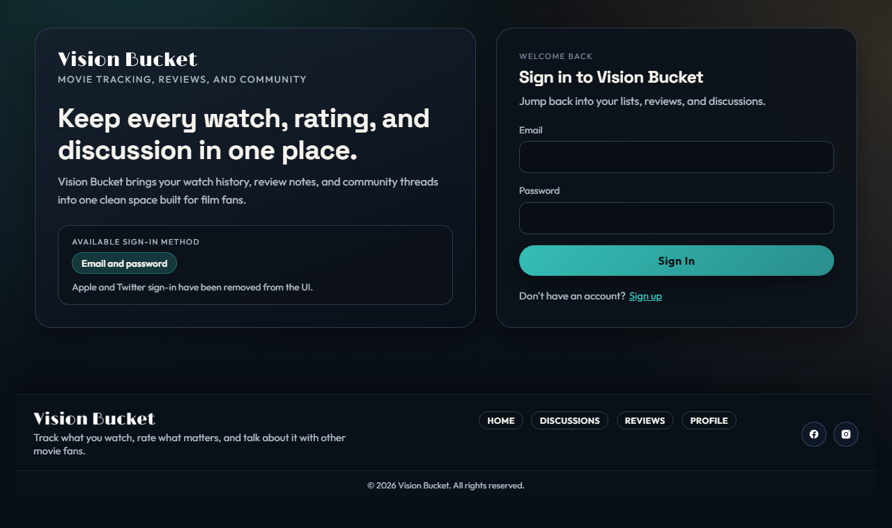
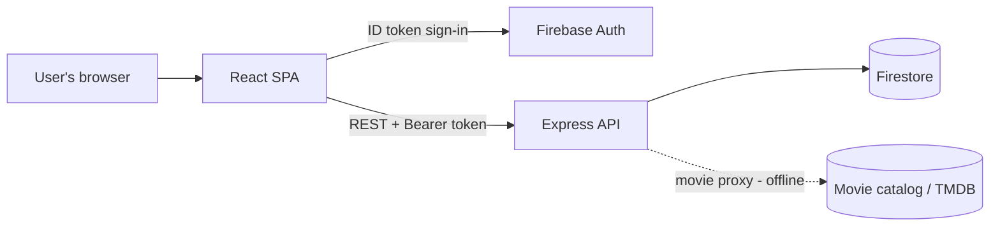

# Vision Bucket

A full-stack movie tracking and community platform. Discover films, track what
you're watching, rate and review titles, and discuss them on community boards.

This repository is the **frontend** — a React + TypeScript single-page app. It
talks to a separate [Express / Firestore backend](https://github.com/thomasdevtran/vision_bucket_backend)
over a REST API and uses Firebase Authentication for sign-in.

> **Live demo:** not currently hosted. See [Screenshots](#screenshots) below, or
> follow [Getting started](#getting-started) to run it locally.

---

## Screenshots



More screenshots (home, movie details, profile, discussions) can be added to
[`docs/screenshots/`](docs/screenshots) and referenced here.

## Features

- **Authentication** — email/password sign-up and sign-in via Firebase Auth.
- **Movie discovery** — browse curated genre shelves and search a movie catalog.
  Movie data is served by a backend proxy (see [Movie data](#movie-data)).
- **Watch tracking** — tag titles as Completed, Dropped, On-hold, Plan-to-watch,
  or Rewatched, with ratings, progress, and notes.
- **Reviews** — write 1–5 star reviews, read community reviews per film, and edit
  or delete your own.
- **Discussion boards** — create threads and comment on General and News boards.
- **Profiles** — per-user dashboard with watch history, stats, and review activity.
- **Responsive UI** — layouts adapt from mobile to desktop.

## Tech stack

| Layer      | Technology                                             |
| ---------- | ------------------------------------------------------ |
| Frontend   | React 18, TypeScript, React Router v6, Create React App |
| Auth       | Firebase Authentication (email/password)               |
| API client | `axios` + `fetch`, with Firebase ID tokens on protected calls |
| Backend    | Node.js / Express 5 + Firestore ([separate repo](https://github.com/thomasdevtran/vision_bucket_backend)) |
| Testing    | Jest + React Testing Library                           |

## Architecture



The SPA authenticates against Firebase Auth, then attaches the resulting Firebase
ID token as a `Bearer` token on every mutating request. The Express API verifies
that token, enforces ownership/roles, and is the **only** path to Firestore — the
Firestore security rules deny all direct client access.

## Getting started

### Prerequisites

- Node.js 18+ and npm
- A [Firebase project](https://console.firebase.google.com/) with Email/Password
  authentication enabled
- The [backend server](https://github.com/thomasdevtran/vision_bucket_backend)
  running locally (default `http://localhost:5000`)

### Install

```bash
git clone https://github.com/trollbro71/vision_bucket.git
cd vision_bucket
npm install
```

### Configure

Copy the example environment file and fill in your own values:

```bash
cp .env.example .env
```

`.env` is gitignored. The Firebase web values are browser-side identifiers (not
secrets), but use your own Firebase project rather than shared credentials.

### Run

```bash
npm start     # dev server at http://localhost:3000
npm test      # run the test suite
npm run build # production build into ./build
```

## Movie data

Movie discovery and search call the backend under `/api/movies/*`. In the original
deployment these routes were served by a hosted movie-catalog proxy (backed by
TMDB). **That proxy is not currently deployed**, so movie browsing/search will
return errors until a proxy is running behind `/api/movies/*`. Every other feature
(auth, reviews, discussions, profiles, watch tracking) runs against the included
Express backend. The frontend handles the missing proxy gracefully by showing an
error message rather than crashing.

## Testing

```bash
npm test -- --watchAll=false
```

Tests cover the movie API service's request contract
([`src/functions/api_service.test.tsx`](src/functions/api_service.test.tsx)) and
review-form validation
([`src/components/movie_details/ReviewForm.test.tsx`](src/components/movie_details/ReviewForm.test.tsx)).
CI runs install → test → build on every push and pull request
([`.github/workflows/ci.yml`](.github/workflows/ci.yml)).

## Project structure

```
src/
  components/   Reusable UI (header, footer, profile, reviews, discussion)
  pages/        Route-level views (home, auth, profile, discussions, movie details)
  functions/    API clients and Firebase setup (api_service, firebase_backend)
  context/      Auth context provider
  config.ts     API base URL
  index.tsx     Router + app entry
```

## My contributions

Vision Bucket started as a team project for a university course (UC Irvine,
Informatics 124). Since then I've substantially rebuilt and extended it on my own.
Across the frontend and the companion backend I:

- Built out the React/TypeScript UI — profiles, movie details, the reviews flow,
  discussion boards, and the authentication screens.
- Designed the secured REST backend (Express 5 + Firestore): Firebase ID-token
  authentication middleware, role-based authorization, per-resource ownership
  checks, CORS allow-listing, rate limiting, and structured request logging.
- Normalized the Firestore data model (deterministic `watch_entries` and
  top-level `comments`) and wrote a reversible, dry-run-first migration.
- Added the test suites (Jest on the frontend; unit + Firebase-emulator
  integration tests on the backend) and set up CI.

> This began as coursework; the security hardening, data-model normalization,
> migration, tests, and CI are extensions I did afterward.

## Related

- Backend API: [vision_bucket_backend](https://github.com/thomasdevtran/vision_bucket_backend)
